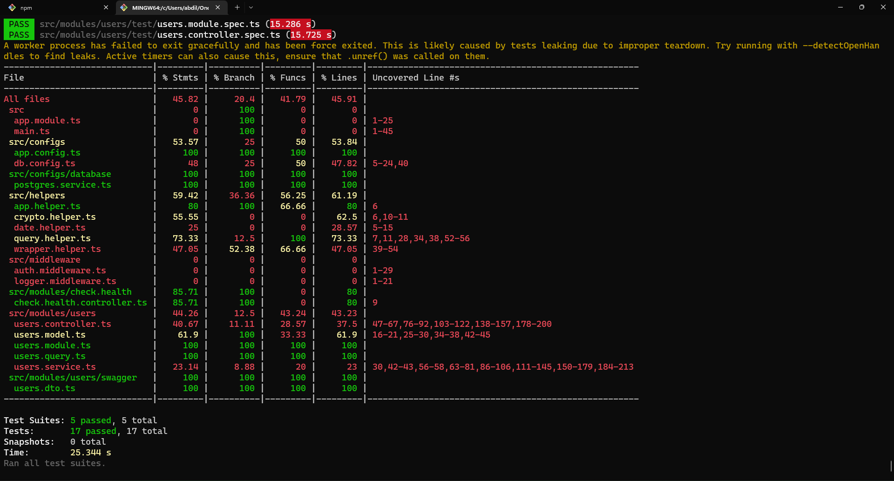
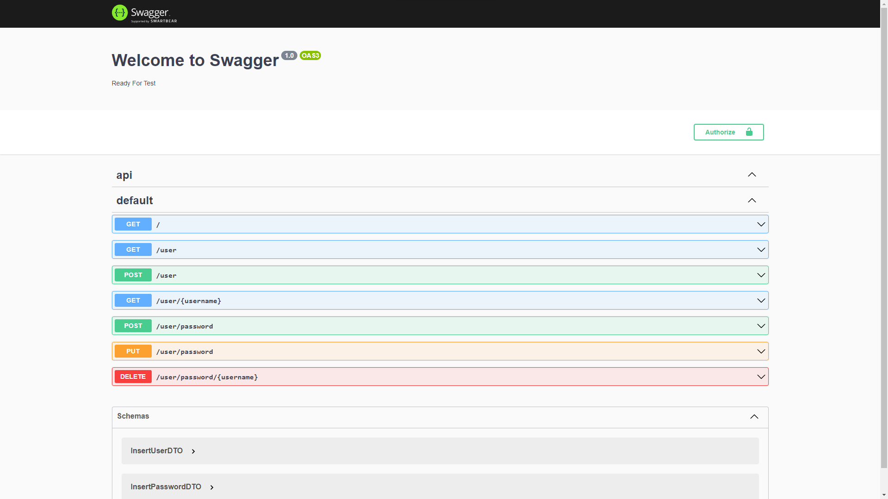

## Evidence

# Unit Testing
```
npm run test:cov
```


# Swagger
```
localhost:{{PORT}}/api
```


# Database
```
dir: src/script
```


## Stay in touch

- Author - [Abdillah Dzulfikar Mustanir](https://github.com/abdillahtop)
- Linkedin - [Abdillah Dzulfikar Mustanir](https://www.linkedin.com/in/abdillahdm/)

